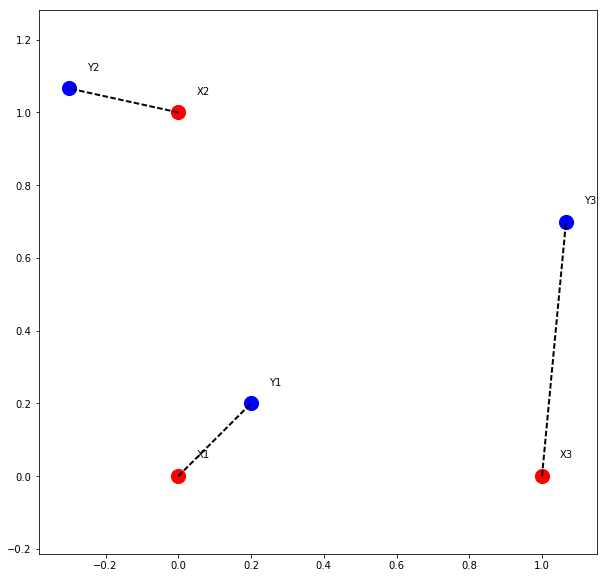
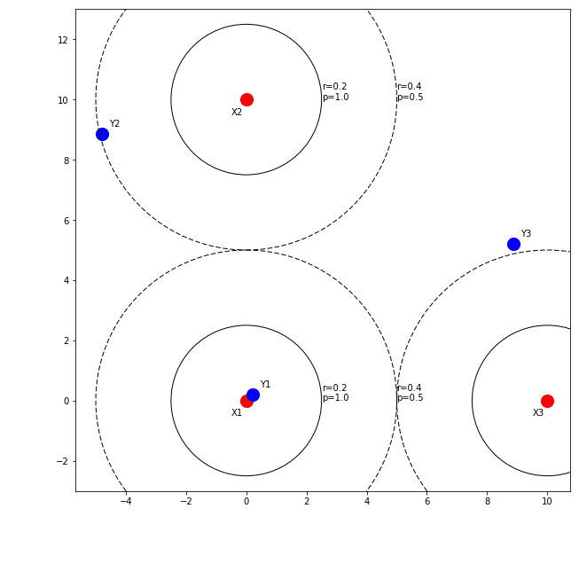

*If you are only looking for code for the coherent point drift algorithm in Python, look at this [Pypi](https://pypi.python.org/pypi/pycpd/0.1) package. Or if you prefere to build from source, you can look at the following [Github](https://github.com/siavashk/pycpd).*

## Introduction
During my PhD, I was working on the specific problem of MR-US fusion for prostate biopsies. MR-US fusion simply means Magnetic-Resonance-UltraSound fusion. This typically involves solving a registration problem which aims to find the optimal transformation between a source (MR) and a target (US) prostate image. Both MR and US images comprise of multiple slices that span the prostate to create a volumetric view of the anatomy.

A popular approach for MR-US fusion prostate biopsy is to use a surface-based registration method. In this approach the prostate is first segmented, meaning that a trained radiologist contours and extracts the surface of the prostate in both US and MR volumes. Then, surface-based registration is performed to align the two volumes.

A related problem to surface-based registration is point cloud registration. They are some times used interchangeably in the literature. Strictly speaking, surface-based registration deals with surfaces that have connectivity information (think faces). Point cloud registration, on the other hand deals with, well, clouds of points without connectivity information (think vertices).

A point cloud registration, method that I found particularly useful was the [Coherent Point Drift](https://arxiv.org/abs/0905.2635) (CPD) algorithm by Myronenko and Song. They formulate the registration as a probability density estimation problem, where one point cloud is represented using a Gaussian Mixture Model (GMM) and the other point cloud is observations from said GMM.

## Point
Let's start off with a simple toy example. Assume that we have two point clouds \\(X = \left\{ X1, X2, X3 \} \\) and \\(Y = \{ Y1, Y2, Y3 \} \\). These point clouds are shown in Figure 1 with red and blue circles, respectively. Our goal is to find the transformation that best aligns the two point clouds.

In this toy example, the unknown transformation is a rotation around the origin (parameterized by \\(\theta\\)) followed by a translation (parameterized by \\(t\\)).Assume, the actual value of the unknown parameters is \\( \{ \theta=30^\circ, t=(0.2, 0.2) \} \\). We can use numpy to define the two point clouds as seen in the following code snippet:

 ```python
import numpy as np

theta = np.pi/6.0
t = np.array([[0.2], [0.2]])

# rotation matrix
R = np.array([[np.cos(theta), -np.sin(theta)],
              [np.sin(theta), np.cos(theta)]])
X = np.array([[0, 0, 1], [0, 1, 0]])
Y = np.dot(R, X) + t

xLabels = ["X1", "X2", "X3"]
yLabels = ["Y1", "Y2", "Y3"]
```

Plotting the two point clouds results in Figure 1. Now, since this is a toy example, we already know the correspondences between points in the two point clouds. The corresponding points are linked using the black dashed line. If the correspondences are known, the solution to the rigid registration is known as the orthogonal Procrustes problem:

$$\mathrm{argmin}_{R,t}\left\||X - RY - t\right\||^2$$ subject to \\(R^TR=I\\) and \\(\mathrm{det}(R)=1\\).

<br>
<br/>

## Missing Correspondences
When correspondence is not explicitly known, point cloud registration algorithms implicitly assume that correspondence can be inferred through point proximity. In other words, points that are spatially close to each other correspond to one another.

We can assign an arbitrary correspondence probability to point clouds based on proximity. Figure 2 shows an example probability distribution based on proximity.

Points that are closer than a radius of \\(r=0.2\\) would confident matches, and we would assign a correspondence confidence of \\(p=1.0\\) to them. Pairs such as \\(\left\(X1, Y1\right\)\\) and \\(\left\(X2, Y2\right\)\\) pairs have a distance between \\(r=0.2\\) and \\(r=0.4\\) units are probable but not confident matches, so we could assign a probability of \\(p=0.5\\) to them. Beyond this, there is probably no correspondence, so our probability would drop to zero.

Even though this approach is quite simple, it provides two distinct advantages. First, it allows us to assign correspondences so that we can solve the registration as a Procrustes problem. Furthermore, it also allows us to weigh the loss functional in the Procrustes problem according to the correspondence probability.
<br>
<br/>

## Gaussian Mixture Models
